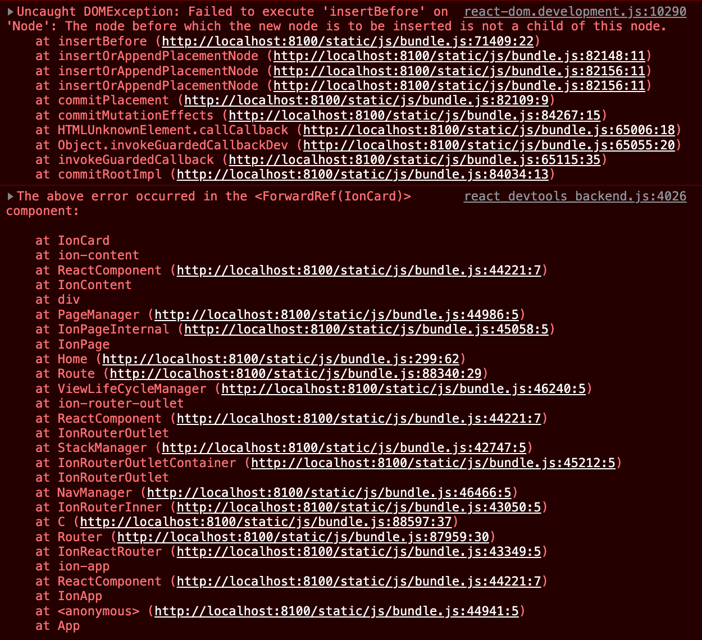

# Modal Issue w/useState Hook
This app has an array with `useState` that renders out multiple `<IonCard />` components.
When using the "Add One" button, another element is added to the array and rendered as expected.
When opening the modal, entering a note and selecting "save" throws an error:

  

